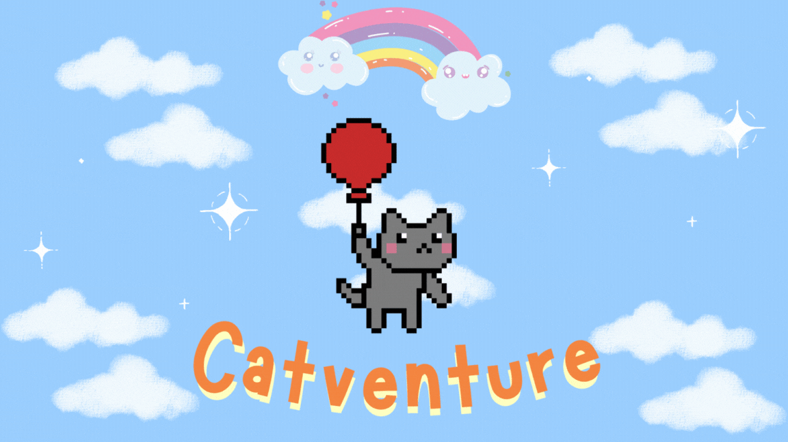
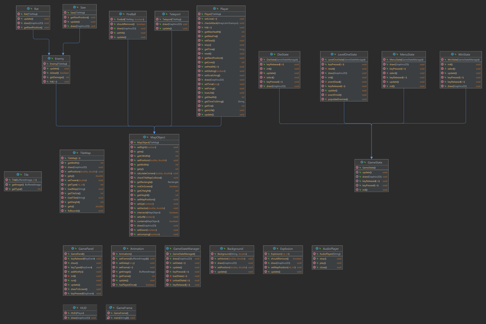

 
  

<h1 align="center"> CATVENGER </h1>
<h3 align="center"> HCMIU - OOP Final Project </h3>

 
  

<!-- TABLE OF CONTENTS -->
<h2 id="table-of-contents"> :book: Table of Contents</h2>

  
Table of Contents

  <ol>
    <li><a href="#about-the-game"> ➤ About The Game</a>
      <ol>
        <li><a href="#intro"> Introduction</a></li>
        <li><a href="#rules"> Rules</a></li>
        <li><a href="#demo"> Demo</a></li>
      </ol>
    </li>
    <li><a href="#about-the-project"> ➤ About The Project</a>
      <ol>
        <li><a href="#uml"> UML</a></li>
        <li><a href="#game-features"> Game Features</a></li>
        <li><a href="#future-features"> Future Features</a></li>
      </ol>
    </li>
    <li><a href="#contributors"> ➤ Contributors</a></li>
  </ol>

<!-- ABOUT THE GAME -->
<h2 id="about-the-game"> :cloud: About The Game</h2>

<h3 id="intro"> Introduction </h3>

 
//

<h3 id="rules"> Rules </h3>
//
  
<h3 id="demo"> Demo </h3>
  //

<!-- ABOUT THE PROJECT -->
<h2 id="about-the-project"> :pencil: About The Project</h2>
  
<h3 id="uml"> UML </h3>
  
  
<h3 id="game-features"> Game Features </h3>
  <ul>
    <li>//</li>
    <li>//</li>
    <li>//</li>
    <li>//</li>
    <li>//</li>
    <li>//</li>
  </ul>
  
<h3 id="future-features"> Future Features </h3>
  <ul>
    <li>//</li>
    <li>//</li>
  </ul>
  

<!-- CONTTRIBUTORS -->
<h2 id="contributors"> :small_orange_diamond: Contributors</h2>

**Trần Phương Quang Huy - ITCSIU21071**  
**Nguyễn Thị Phương Thảo - ITITITIU21214**       
**Nguyễn Thị Anh Thơ - ITCSIU21236**  
**Bùi Như Ý - ITCSIU21247**  

